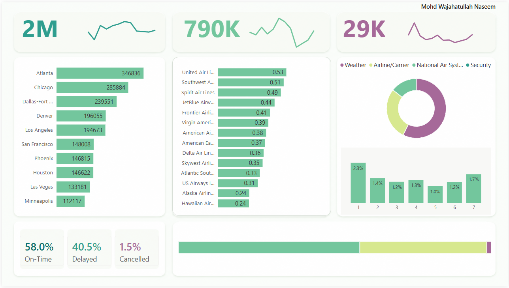

# ✈️ Airline Operations Performance Dashboard (Power BI)



## 🌐 Live Dashboard

[](https://app.powerbi.com/view?r=eyJrIjoiMmU4YWI1MWYtMTk0ZS00NzljLWIyYzctMDM4YjQxMjA5ZTE1IiwidCI6IjFkZjNkMzdmLTkzZGMtNDI5Ny1hYzcyLTRhNWYzZWVkZmNmMiJ9)

🔗 Click the dashboard preview above to open the interactive Power BI report.

This project presents an **interactive Airline Operations Performance Dashboard** built using **Power BI**.  
The dashboard focuses on analyzing **flight operations, delays, cancellations, airline performance, and airport activity** to help identify operational inefficiencies and performance trends.

This project is designed for:
- ✅ **Data Analyst / Business Intelligence Interviews**
- ✅ **Operational Analytics Demonstrations**
- ✅ **Portfolio & Dashboard Showcasing**
- ✅ **Aviation Performance Reporting**

---

## 🎯 Business Objectives

This dashboard helps answer important operational questions such as:

- Which airlines maintain the **best on-time performance**?
- What are the major causes of **flight delays and cancellations**?
- Which airports handle the **highest traffic volume**?
- How do operational metrics vary across airlines?
- What percentage of flights are:
  - On-Time
  - Delayed
  - Cancelled

---

## 🚀 Key Features

- ✅ **Interactive Operational KPI Dashboard**
- ✅ **Flight Delay & Cancellation Analysis**
- ✅ **Airline Performance Comparison**
- ✅ **Airport Traffic Monitoring**
- ✅ **Delay Reason Distribution Analysis**
- ✅ **On-Time Performance Tracking**
- ✅ **Executive KPI Cards**
- ✅ **Modern & Minimal Dashboard Design**
- ✅ **Business-Oriented Data Storytelling**

---

## 📊 KPIs Tracked

The dashboard monitors the following operational metrics:

- Total Flights
- Total Delayed Flights
- Total Cancelled Flights
- On-Time Percentage
- Delay Percentage
- Cancellation Percentage
- Airline Performance Score
- Airport Traffic Volume

---

## ▶️ Dashboard Walkthrough

### 🔹 Top KPI Cards
Displays:
- Total operational volume
- Delayed flights
- Cancelled flights
- Trend indicators for operational changes

---

### 🔹 Airport Performance Analysis
Highlights airports with:
- Highest traffic
- Operational bottlenecks
- Delay concentration

---

### 🔹 Airline Performance Comparison
Ranks airlines based on:
- On-time efficiency
- Delay rates
- Operational consistency

---

### 🔹 Delay Reason Analysis
Breaks delays into categories such as:
- Weather
- Airline/Carrier
- National Air System
- Security

This helps identify the primary operational challenges affecting performance.

---

### 🔹 Flight Status Distribution
Displays the percentage of:
- On-Time Flights
- Delayed Flights
- Cancelled Flights

for quick executive-level monitoring.

---

## 🧠 Data Model Overview

The dashboard follows a **Star Schema Data Model** for optimized performance and scalability.

### Fact Table
- `Flights`

### Dimension Tables
- `Airline`
- `Airport`
- `Date`
- `Delay Category`

This structure enables:
- Faster filtering
- Better DAX performance
- Clean relationships
- Scalable analytics

---

## 🧮 Key DAX Measures Used

```DAX
Total Flights =
COUNT(Flights[Flight Number])

Delayed Flights =
CALCULATE(
    COUNT(Flights[Flight Number]),
    Flights[Status] = "Delayed"
)

Cancelled Flights =
CALCULATE(
    COUNT(Flights[Flight Number]),
    Flights[Status] = "Cancelled"
)

On-Time % =
DIVIDE(
    [On-Time Flights],
    [Total Flights]
)

Delay % =
DIVIDE(
    [Delayed Flights],
    [Total Flights]
)

Cancellation % =
DIVIDE(
    [Cancelled Flights],
    [Total Flights]
)
